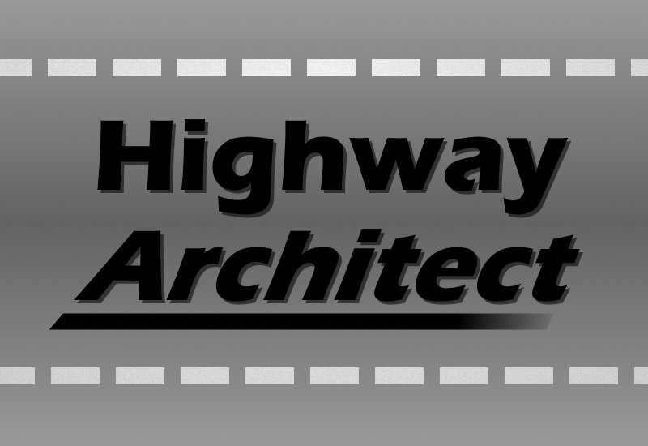

# Highway Architect

## Project about highways

## Milestone
- Usable and visible UI
- Green plane on white background, movable camera by mouse input with restrictions

### ToDo
- Game loop √
  - Threads √
- Input     √
  - Ctrl, alt and shift √
  - Pressed or released √
  - MouseWheel √
- UI
  - Qol rework for panels √
  - Basic component √
  - Button √
  - Slider √
- Graphics
  - Open-gl
  - Buffer stuff
  - UI
  - Shaders √
  - 3D utils.math √
  
- Graphics
  - Restructure shader uniforms
  - Shader Storage Objects
  - Abstract batch rendering for easier use
  - Textured 3d models
  - Text rendering
  - Skybox
  - Simple terrain texturing
- Roads
  - Straight road segment
  - Curved road segment
  - Lanes in road segments
  - Segment snapping
  - Lane snapping
  - Remove bottom faces of roads
  - Asphalt texturing
- Utils
  - Make all math utils useable statically
- UI
  - Restructure UI for panel use
- Input
  - Input events
- Camera
  - Acceleration and deceleration
  - Smooth scrolling

